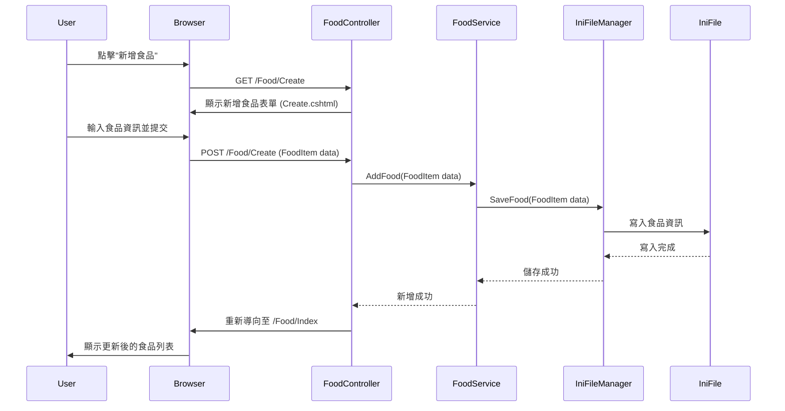
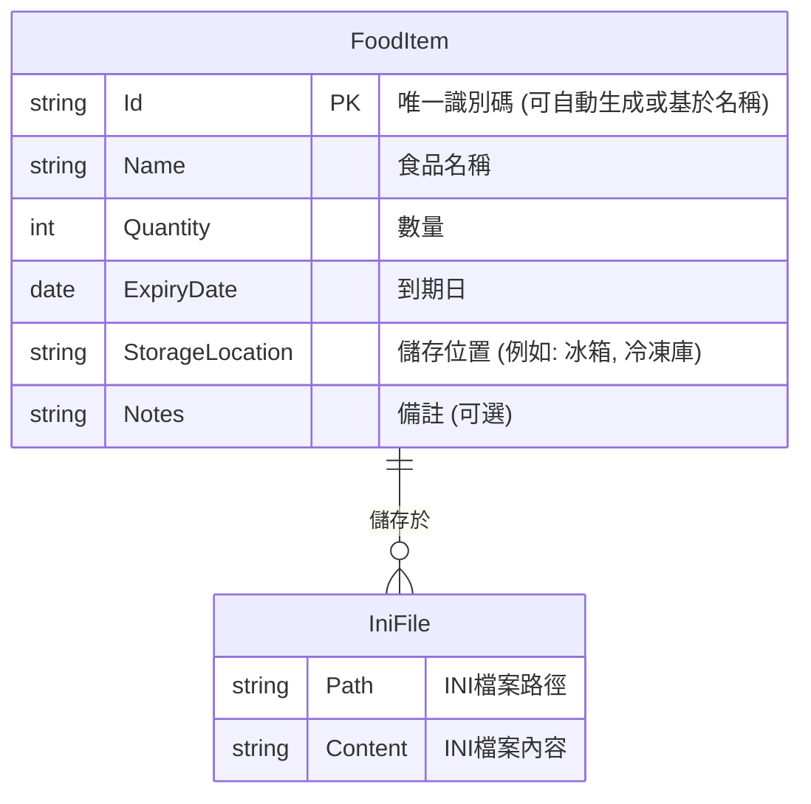

# 冰箱食品管理Web系統規格文件

## 1. 專案概述

本文件旨在詳細說明「冰箱食品管理Web系統」的設計規格。該系統旨在協助使用者有效管理冰箱內的食品，追蹤食品的名稱、數量、到期日和儲存位置。

## 2. 技術棧

*   **後端框架:** .NET Core 8 MVC
*   **前端技術:** HTML5, CSS3, JavaScript (Razor Views)
*   **資料儲存:** INI 文字檔案

## 3. 系統功能

*   **食品列表:** 顯示所有冰箱中的食品資訊。
*   **新增食品:** 允許使用者輸入食品名稱、數量、到期日、儲存位置等資訊，並新增至系統。
*   **編輯食品:** 允許使用者修改現有食品的資訊。
*   **刪除食品:** 允許使用者從系統中移除食品。
*   **查詢食品:** 允許使用者根據名稱、到期日或儲存位置等條件查詢食品。

## 4. 系統架構設計

### 4.1. MVC 層次組織

本系統將遵循標準的 .NET Core MVC 架構模式，並引入服務層 (Service Layer) 和資料存取層 (Data Access Layer) 以實現職責分離。

*   **Controllers (控制器):**
    *   負責處理 HTTP 請求，協調 Model 和 View。
    *   保持輕量化，僅包含請求處理和結果返回邏輯。
    *   範例: `FoodController` (處理食品相關操作)。

*   **Models (模型):**
    *   **資料模型:** 定義系統中的資料實體，例如 `FoodItem`。
    *   **業務邏輯:** 核心業務邏輯將封裝在獨立的服務層中。

*   **Views (視圖):**
    *   使用 Razor 視圖引擎，負責呈現使用者介面。
    *   為每個功能模組提供對應的視圖檔案。
    *   範例: `Views/Food/Index.cshtml`, `Views/Food/Create.cshtml`。

*   **Services (服務層):**
    *   包含核心業務邏輯，處理資料的增、刪、改、查等操作。
    *   與資料存取層互動，但不直接與 INI 檔案互動。
    *   範例: `FoodService`。

*   **Data (資料存取層 - DAL):**
    *   負責與 INI 檔案進行實際的讀寫操作。
    *   將 INI 檔案的解析、序列化/反序列化邏輯集中管理。
    *   範例: `IniFileManager` 或 `FoodIniRepository`。

### 4.2. INI 檔案結構與處理

*   **INI 檔案路徑:** INI 檔案的路徑將配置在 `appsettings.json` 中。
*   **INI 檔案結構:** 每個食品項目將作為 INI 檔案中的一個獨立 Section，Section 名稱可以是一個唯一識別碼 (例如 `Food_GUID`)。每個 Section 包含食品的屬性作為 Key-Value 對。

    ```ini
    [Food_GUID1]
    Name=牛奶
    Quantity=1
    ExpiryDate=2025-06-01
    StorageLocation=冰箱
    Notes=低脂

    [Food_GUID2]
    Name=雞蛋
    Quantity=12
    ExpiryDate=2025-06-15
    StorageLocation=冰箱
    Notes=土雞蛋
    ```

*   **INI 檔案讀寫:**
    *   將自行實作或引入輕量級函式庫來處理 INI 檔案的讀寫。
    *   讀取時，將 INI Section 和 Key-Value 對反序列化為 `FoodItem` 物件。
    *   寫入時，將 `FoodItem` 物件序列化為 INI Section 和 Key-Value 對。

## 5. UML 圖

### 5.1. 流程圖 (Flowchart)

```mermaid
graph TD
    A[使用者] --> B{啟動Web系統};
    B --> C[顯示食品列表];
    C --> D{選擇操作};
    D -- 新增食品 --> E[顯示新增食品表單];
    E --> F{輸入食品資訊};
    F --> G[提交表單];
    G --> H[驗證資料];
    H -- 驗證失敗 --> E;
    H -- 驗證成功 --> I[儲存食品至INI檔案];
    I --> J[重新導向至食品列表];
    D -- 編輯食品 --> K[選擇要編輯的食品];
    K --> L[顯示編輯食品表單 (預填資訊)];
    L --> M{修改食品資訊};
    M --> N[提交表單];
    N --> O[驗證資料];
    O -- 驗證失敗 --> L;
    O -- 驗證成功 --> P[更新INI檔案中的食品資訊];
    P --> J;
    D -- 刪除食品 --> Q[選擇要刪除的食品];
    Q --> R[確認刪除];
    R -- 確認 --> S[從INI檔案中刪除食品];
    S --> J;
    D -- 查詢食品 --> T[輸入查詢條件];
    T --> U[從INI檔案中篩選食品];
    U --> V[顯示查詢結果];
    V --> D;
```

### 5.2. 循序圖 (Sequence Diagram)

**新增食品循序圖**



### 5.3. 關聯圖 (Relationship Diagram)



## 6. 錯誤處理與資料驗證

*   **錯誤處理:** 針對檔案讀寫錯誤、資料格式錯誤等情況，系統應提供友善的錯誤提示。
*   **資料驗證:** 在接收使用者輸入時，對食品名稱、數量、到期日等欄位進行必要的驗證，確保資料的完整性和正確性。

## 7. 部署考量

*   本系統為 .NET Core 應用程式，可部署於支援 .NET Core 執行環境的任何平台 (Windows, Linux, macOS)。
*   INI 檔案將儲存在應用程式可讀寫的目錄中。